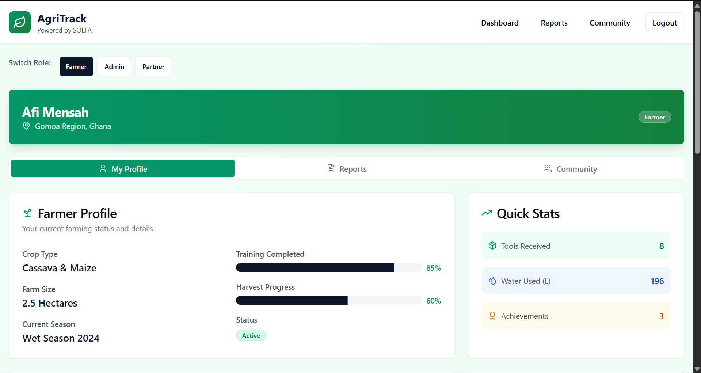

# Agri-Life Insights

A modern, responsive web application built with React, TypeScript, and Vite, featuring a beautiful UI powered by Shadcn UI components and Tailwind CSS.



## 🚀 Features

- **Modern Tech Stack**: Built with React 18, TypeScript, and Vite
- **Beautiful UI**: Powered by Shadcn UI components and Tailwind CSS
- **Type Safety**: Full TypeScript support
- **Responsive Design**: Mobile-first approach with Tailwind CSS
- **Form Handling**: Advanced form management with React Hook Form and Zod validation
- **Data Visualization**: Interactive charts and graphs using Recharts
- **Routing**: Client-side routing with React Router DOM
- **State Management**: Efficient data fetching with TanStack Query
- **Theme Support**: Dark/Light mode support with next-themes

## 📋 Prerequisites

Before you begin, ensure you have the following installed:

- Node.js (v16 or higher)
- npm or yarn or bun

## 🛠️ Installation

1. Clone the repository:

```bash
git clone [repository-url]
cd agri-life-insights
```

2. Install dependencies:

```bash
npm install
# or
yarn install
# or
bun install
```

3. Start the development server:

```bash
npm run dev
# or
yarn dev
# or
bun dev
```

## 🏗️ Project Structure

```
src/
├── components/     # Reusable UI components
├── pages/         # Page components
├── lib/           # Utility functions and configurations
├── hooks/         # Custom React hooks
└── App.tsx        # Main application component
```

## 🚀 Available Scripts

- `npm run dev` - Start development server
- `npm run build` - Build for production
- `npm run build:dev` - Build for development
- `npm run lint` - Run ESLint
- `npm run preview` - Preview production build

## 🛠️ Built With

- [React](https://reactjs.org/) - Frontend library
- [TypeScript](https://www.typescriptlang.org/) - Type safety
- [Vite](https://vitejs.dev/) - Build tool
- [Tailwind CSS](https://tailwindcss.com/) - Styling
- [Shadcn UI](https://ui.shadcn.com/) - UI components
- [React Router](https://reactrouter.com/) - Routing
- [TanStack Query](https://tanstack.com/query) - Data fetching
- [Recharts](https://recharts.org/) - Data visualization
- [React Hook Form](https://react-hook-form.com/) - Form handling
- [Zod](https://zod.dev/) - Schema validation

## 🤝 Contributing

1. Fork the repository
2. Create your feature branch (`git checkout -b feature/AmazingFeature`)
3. Commit your changes (`git commit -m 'Add some AmazingFeature'`)
4. Push to the branch (`git push origin feature/AmazingFeature`)
5. Open a Pull Request

## 📝 License

This project is licensed under the MIT License - see the LICENSE file for details.

## 👥 Authors

- Jescaps Antwi
- Learn m

## 🙏 Acknowledgments

- Shadcn UI for the beautiful component library
- Vite team for the amazing build tool
- All contributors who have helped shape this project
